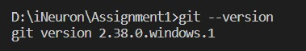
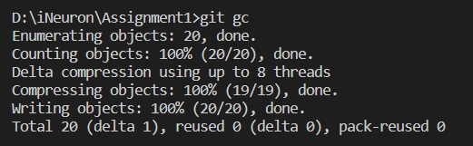
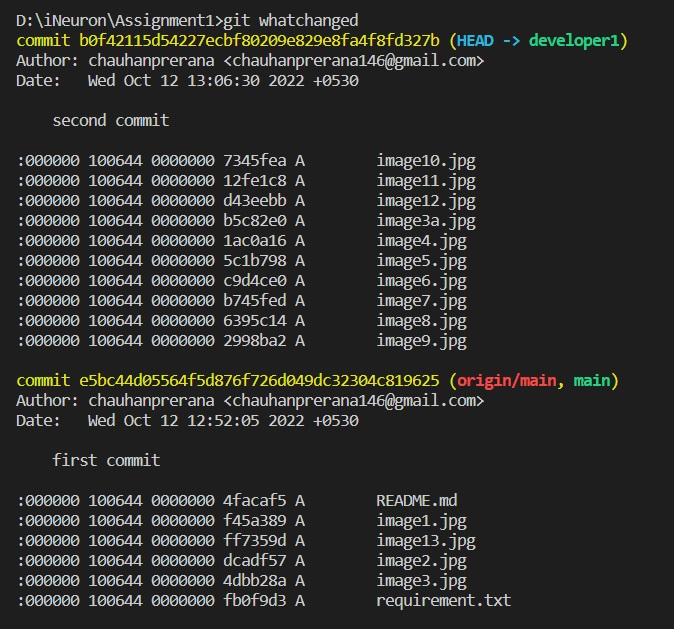

# Assignment 1
## Task 1

Demonstrate minimum 15 basic Git command with explanation and screenshot.

1. git config
This command will set up your identity - Name and Email address. And this information will be used with every commit.

$ git config --global user.name "chauhanprerana"  
$ git config --global user.email "chauhanprerana146@gmail.com"

2. git version
To check which version of Git you are using. 

$ git version

3. git add
The Git add command will add all the new code files or modified files into your repository. 

$ git add your_file_name (it will add a single file to your staging area)

$ git add . ( this option will add all the modified and new files to the staging area)

4. git commit
Git commit will add your changes to your local repository.

$ git commit -m “your useful commit message”

5. git status 
This Git command is convenient to see how many files are there which need your attention. 

$ git status

6. git branch
To list all branches

$ git branch

7. git branch <branch_name>
To create a new branch

$ git branch developer1

8. git branch -d <branch_name>
To delete a branch

$ git branch -d developer1

9. git checkout
This Git command is used to switch between branches.

$ git checkout developer1

10. git log
With the help of the Git log, you can see all the previous commits with the most recent commit appear first.

$ git log

11. git help
If you need more help with any command, you can use git help at any time from the terminal.

$ git help <git_command>

12. git push
This command sends the committed changes of master branch to your remote repository.

$ git push [variable name] master

13. git init
The command helps in the creation of the initial .git directory in an existing or new project.

$ git init

14. git gc
It helps in collection of garbage from a repository and ensuring optimization of the repository.

$ git gc

15. git whatchanged
To view what changes each individual git commit introduces to the project.

$ git whatchanged

